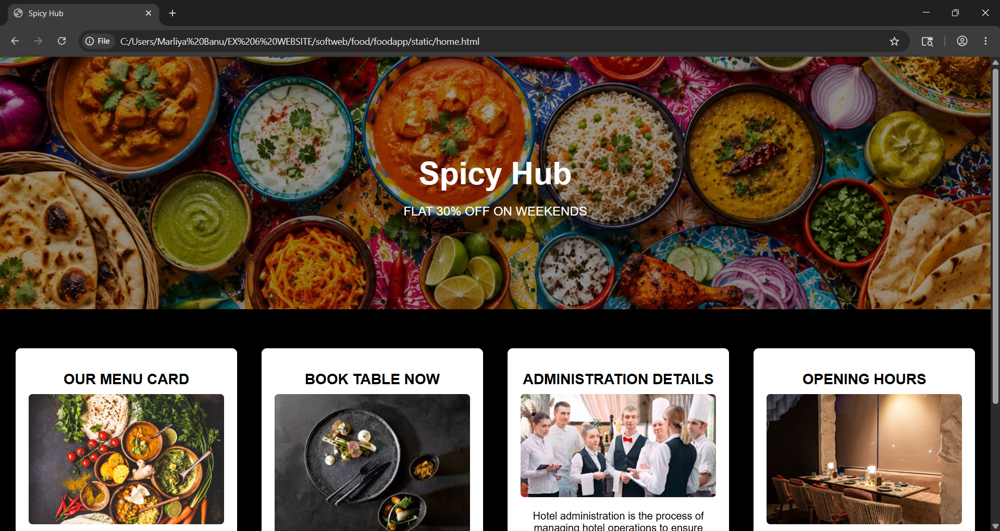
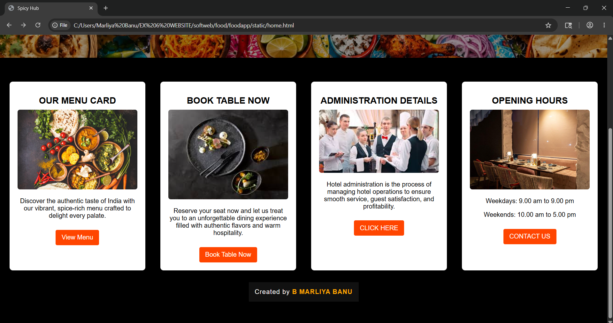
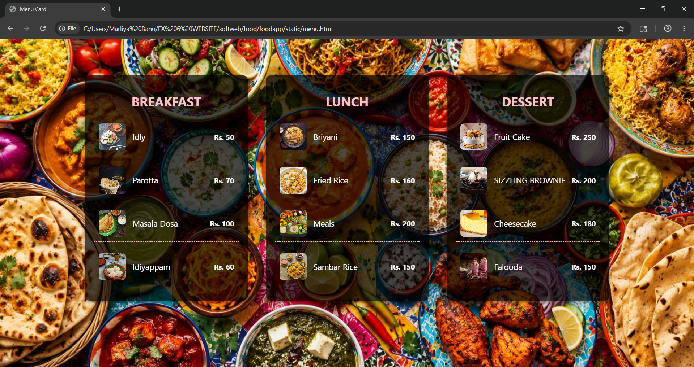
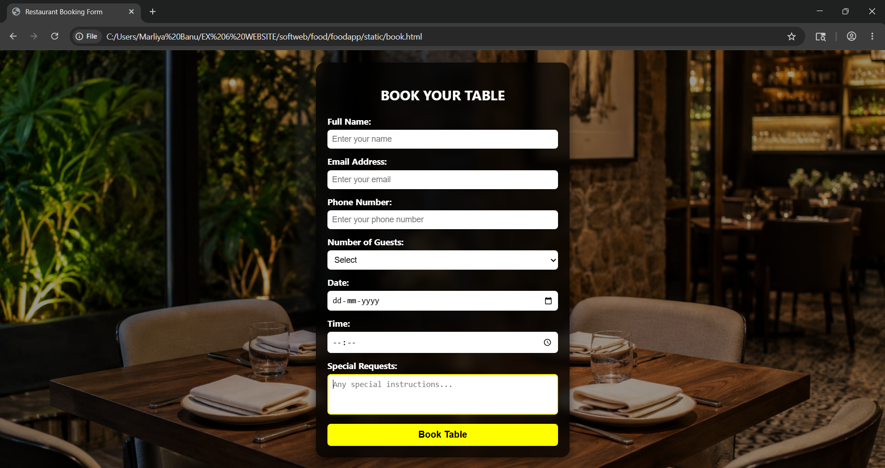
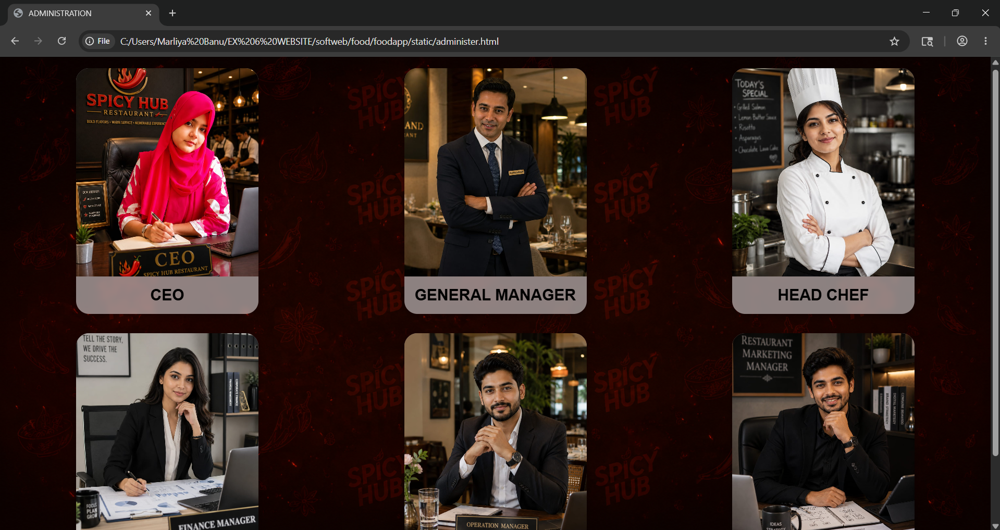
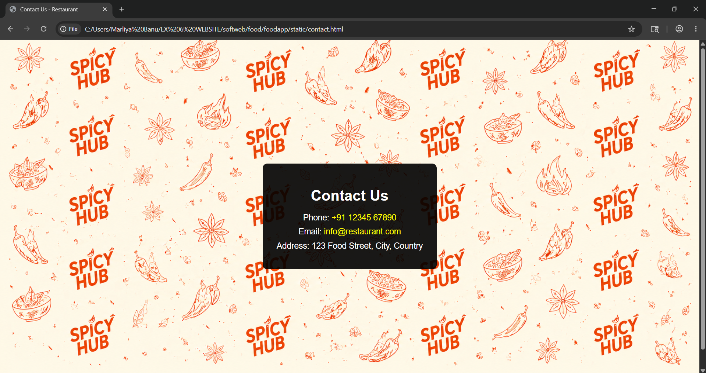

# Ex.06 Restuarant Website
## Date:23-5-26

## AIM:
To develop a static Resturant website to display the menu and services provided by the resturant.

## DESIGN STEPS:

### Step 1:
Requirement collection.

### Step 2:
Creating the layout using HTML and CSS.

### Step 3:
Updating the sample content.

### Step 4:
Choose the appropriate style and color scheme.

### Step 5:
Validate the layout in various browsers.

### Step 6:
Validate the HTML code.

### Step 7:
Publish the website in the given URL.

## PROGRAM:
HOME.HTML 

```
<!DOCTYPE html>
<html lang="en">
<head>
  <meta charset="UTF-8">
  <title>Spicy Hub</title>
  <style>
    body {
      margin: 0;
      padding: 0;
      font-family: sans-serif;
      color: black;
      background-color:black;
    }
    .banner {
      
      background-image:url("C:\\Users\\Marliya Banu\\EX 6 WEBSITE\\softweb\\food\\foodapp\\static\\images\\bg6.jpeg");
      background-size: cover;
      background-position: center;
      background-repeat: no-repeat;
      text-align: center;
      color: white;
      padding: 120px 20px;
      position: relative;
    }

    .banner::before {
      content: "";
      position: absolute;
      top: 0;
      left: 0;
      width: 100%;
      height: 100%;
      background-color: rgba(0, 0, 0, 0.4);
      z-index: 0;
    }

    .banner h1, .banner p {
      position: relative;
      z-index: 1;
    }

    .banner h1 {
      font-size: 3em;
      margin-bottom: 10px;
    }

    .banner p {
      font-size: 1.2em;
    }

    .sections {
      display: flex;
      justify-content: space-around;
      flex-wrap: wrap;
      padding: 60px 20px;
      gap: 30px;
    }

    .card {
      background-color: white;
      border-radius: 8px;
      box-shadow: 0 4px 8px rgba(0,0,0,0.1);
      width: 300px;
      text-align: center;
      padding: 20px;
      transition: transform 0.3s ease;
    }

    .card:hover {
      transform: scale(1.05);
    }

    .card img {
      width: 100%;
      border-radius: 6px;
    }

    .card h2 {
      margin: 15px 0 10px;
      font-size: 1.4em;
    }

    .card a {
      display: inline-block;
      margin-top: 10px;
      padding: 10px 15px;
      background-color: orangered;
      color: white;
      text-decoration: none;
      border-radius: 4px;
    }

    .card a:hover {
      background-color: orangered;
    }
  </style>
</head>
<body>

  <header class="banner">
    <h1>Spicy Hub</h1>
    <p>FLAT 30% OFF ON WEEKENDS</p>
  </header>

  <section class="sections">
    <div class="card">
      <h2>OUR MENU CARD</h2>
      
      <p>Discover the authentic taste of India with our vibrant, spice-rich menu crafted to delight every palate.</p>
      <a href="menu.html">View Menu</a>
    </div>

    <div class="card">
      <h2>BOOK TABLE NOW</h2>
      
      <p>Reserve your seat now and let us treat you to an unforgettable dining experience filled with authentic flavors and warm hospitality.</p>
      <a href="book.html">Book Table Now</a>
    </div>


      <div class="card">
      <h2>ADMINISTRATION DETAILS</h2>
      
      <p>Hotel administration is the process of managing hotel operations to ensure smooth service, guest satisfaction, and profitability.</p>
      <a href="administer.html">CLICK HERE</a>
    </div>

    <div class="card">
      <h2>OPENING HOURS</h2>
      
      <p>Weekdays: 9.00 am to 9.00 pm</p>
      <p>Weekends: 10.00 am to 5.00 pm</p>
      <a href="contact.html">CONTACT US</a>
    </div>

  </section>

</body>
</html>
```
MENU.HTML

```
<!DOCTYPE html>
<html lang="en">
<head>
    <meta charset="UTF-8">
    <title>Menu Card</title>
    <style>
        body {
            margin: 0;
            padding: 0;
            font-family: 'Segoe UI', sans-serif;
            height: 100vh;
            display: flex;
            flex-wrap: wrap;
            justify-content: center;
            align-items: flex-start;
            padding-top: 60px;
            color: white;
            position: relative;
            overflow: hidden;
        }
        body::before {
            content: "";
            position: fixed;
            top: 0;
            left: 0;
            width: 100%;
            height: 100%;
            background-image:url("C:\\Users\\Marliya Banu\\EX 6 WEBSITE\\softweb\\food\\foodapp\\static\\images\\bg6.jpeg");
            background-size: cover;
            background-position: center;
            background-repeat: no-repeat;
            filter: darken(2px) brightness(0.6);
            z-index: -1;
        }

        .menu-card {
            background-color: rgba(0, 0, 0, 0.7);
            border-radius: 10px;
            padding: 20px;
            margin: 20px;
            width: 320px;
            box-shadow: 0 4px 8px rgba(0,0,0,0.4);
        }

        .menu-card h1 {
            text-align: center;
            color:pink;
            margin-bottom: 20px;
            font-size: 28px;
            text-transform: uppercase;
        }

        .menu-item {
            display: flex;
            align-items: center;
            justify-content: space-between;
            margin-bottom: 15px;
            padding: 10px;
            border-bottom: 1px dashed pink;
        }

        .menu-item img {
            width: 60px;
            height: 60px;
            object-fit: cover;
            border-radius: 8px;
            margin-right: 15px;
        }

        .item-details {
            flex-grow: 1;
        }

        .item-name {
            font-size: 18px;
            color: white;
        }

        .item-price {
            font-weight: bold;
            color:white;
        }
    </style>
</head>
<body>

    <div class="menu-card">
        <h1>BREAKFAST</h1>
        <div class="menu-item">
            
            <div class="item-details"><div class="item-name">Idly</div></div>
            <div class="item-price">Rs. 50</div>
        </div>

        <div class="menu-item">
            
            <div class="item-details"><div class="item-name">Parotta</div></div>
            <div class="item-price">Rs. 70</div>
        </div>

        <div class="menu-item">
            
            <div class="item-details"><div class="item-name">Masala Dosa</div></div>
            <div class="item-price">Rs. 100</div>
        </div>

        <div class="menu-item">
            
            <div class="item-details"><div class="item-name">Idiyappam</div></div>
            <div class="item-price">Rs. 60</div>
        </div>
    </div>

    <div class="menu-card">
        <h1>LUNCH</h1>
        <div class="menu-item">
            
            <div class="item-details"><div class="item-name"> Briyani</div></div>
            <div class="item-price">Rs. 150</div>
        </div>

        <div class="menu-item">
            
            <div class="item-details"><div class="item-name">Fried Rice</div></div>
            <div class="item-price">Rs. 160</div>
        </div>

        <div class="menu-item">
            
            <div class="item-details"><div class="item-name">Meals</div></div>
            <div class="item-price">Rs. 200</div>
        </div>

        <div class="menu-item">
            
            <div class="item-details"><div class="item-name">Sambar Rice</div></div>
            <div class="item-price">Rs. 150</div>
        </div>
    </div>

    <div class="menu-card">
        <h1>DESSERT</h1>
        <div class="menu-item">
            
            <div class="item-details"><div class="item-name">Fruit Cake</div></div>
            <div class="item-price">Rs. 250</div>
        </div>

        <div class="menu-item">
            
            <div class="item-details"><div class="item-name">SIZZLING BROWNIE</div></div>
            <div class="item-price">Rs. 200</div>
        </div>

        <div class="menu-item">
            
            <div class="item-details"><div class="item-name">Cheesecake</div></div>
            <div class="item-price">Rs. 180</div>
        </div>

        <div class="menu-item">
            
            <div class="item-details"><div class="item-name">Falooda</div></div>
            <div class="item-price">Rs. 150</div>
        </div>
    </div>

</body>
</html>
```
ADMINISTER.HTML

```
<!DOCTYPE html>
<html lang="en">
<head>
    <meta charset="UTF-8">
    <meta name="viewport" content="width=device-width, initial-scale=1.0">
    <title>ADMINISTRATION</title>

    <style>

        body{
            margin:0;
            padding:20px;
            font-family:Arial, sans-serif;

            background-image:url("C:\\Users\\Marliya Banu\\EX 6 WEBSITE\\softweb\\food\\foodapp\\static\\images\\ct.png");
            background-size:cover;
            background-position:center;
            background-repeat:no-repeat;
            background-attachment:fixed;
        }

        .grid-container{
            display:grid;
            grid-template-columns:repeat(3,1fr);
            gap:30px;
            justify-items:center;
        }

        .image-box{
            width:280px;
            background:rgba(255,255,255,0.5);
            border-radius:20px;
            overflow:hidden; /* removes extra empty space */
            text-align:center;
            backdrop-filter:blur(5px);
            box-shadow:0 4px 10px rgba(0,0,0,0.3);
        }

        .image-box img{
            width:100%;
            height:320px; 
            object-fit:cover; 
            display:block;
        }

        .image-box h1{
            font-size:24px;
            margin:15px 10px;
            color:black;
        }

    </style>
</head>

<body>

    <div class="grid-container">

        <div class="image-box">
            
            <h1>CEO</h1>
        </div>

        <div class="image-box">
            
            <h1>GENERAL MANAGER</h1>
        </div>

        <div class="image-box">
            
            <h1>HEAD CHEF</h1>
        </div>

        <div class="image-box">
            
            <h1>FINANCE MANAGER</h1>
        </div>

        <div class="image-box">
            
            <h1>OPERATIONS MANAGER</h1>
        </div>

        <div class="image-box">
            
            <h1>MARKETING MANAGER</h1>
        </div>

    </div>

</body>
</html>
```
BOOK.HTML
```
<!DOCTYPE html>
<html lang="en">
<head>
    <meta charset="UTF-8">
    <meta name="viewport" content="width=device-width, initial-scale=1.0">
    <title>Restaurant Booking Form</title>

    <style>

        body{
            margin:0;
            padding:0;
            font-family:'Segoe UI',sans-serif;

            height:100vh;
            display:flex;
            justify-content:center;
            align-items:center;

            overflow:hidden;
            color:white;
        }

        body::before{
            content:"";
            position:fixed;
            top:0;
            left:0;

            width:100%;
            height:100%;

            background-image:url("C:\\Users\\Marliya Banu\\EX 6 WEBSITE\\softweb\\food\\foodapp\\static\\images\\b1.png");

            background-size:cover;
            background-position:center;
            background-repeat:no-repeat;

            filter:brightness(0.6);

            z-index:-1;
        }

        .booking-form{

            width:400px;

            background:rgba(0,0,0,0.75);

            padding:20px;

            border-radius:15px;

            backdrop-filter:blur(8px);

            box-shadow:0 4px 15px rgba(0,0,0,0.5);
        }

        .booking-form h2{

            text-align:center;

            margin-bottom:20px;

            font-size:24px;

            color:white;

            text-transform:uppercase;
        }

        .form-group{

            margin-bottom:12px;
        }

        label{

            display:block;

            margin-bottom:5px;

            font-size:15px;

            font-weight:bold;
        }

        input,
        select,
        textarea{

            width:100%;

            padding:8px;

            border:none;

            border-radius:6px;

            font-size:14px;

            box-sizing:border-box;
        }

        input:focus,
        select:focus,
        textarea:focus{

            outline:none;

            border:2px solid yellow;
        }

        textarea{

            height:70px;

            resize:none;
        }

        button{

            width:100%;

            padding:10px;

            border:none;

            border-radius:6px;

            background:yellow;

            color:black;

            font-size:16px;

            font-weight:bold;

            cursor:pointer;

            transition:0.3s;
        }

        button:hover{

            background:gold;
        }

    </style>

</head>

<body>

    <form class="booking-form">

        <h2>Book Your Table</h2>

        <div class="form-group">

            <label>Full Name:</label>

            <input type="text" placeholder="Enter your name">

        </div>

        <div class="form-group">

            <label>Email Address:</label>

            <input type="email" placeholder="Enter your email">

        </div>

        <div class="form-group">

            <label>Phone Number:</label>

            <input type="tel" placeholder="Enter your phone number">

        </div>

        <div class="form-group">

            <label>Number of Guests:</label>

            <select>

                <option>Select</option>

                <option>1</option>

                <option>2</option>

                <option>3-4</option>

                <option>5-6</option>

                <option>7-10</option>

            </select>

        </div>

        <div class="form-group">

            <label>Date:</label>

            <input type="date">

        </div>

        <div class="form-group">

            <label>Time:</label>

            <input type="time">

        </div>

        <div class="form-group">

            <label>Special Requests:</label>

            <textarea placeholder="Any special instructions..."></textarea>

        </div>

        <button type="submit">Book Table</button>

    </form>

</body>
</html>
```
CONTACT.HTML
```
<!DOCTYPE html>
<html lang="en">
<head>
    <meta charset="UTF-8">
    <meta name="viewport" content="width=device-width, initial-scale=1.0">
    <title>Contact Us - Restaurant</title>
    <style>
        
        html, body {
            height: 100%;
            margin: 0;
            font-family: Arial, sans-serif;
        }

        body {
            background-image: url("C:\\Users\\Marliya Banu\\EX 6 WEBSITE\\softweb\\food\\foodapp\\static\\images\\ct1.png");
            background-size: cover;        
            background-position: center;
            background-repeat: no-repeat;  
            display: flex;
            justify-content: center;       
            align-items: center;          
            padding: 20px;
        }

        .container {
            max-width: 600px;
            background-color: rgba(0, 0, 0, 0.9); 
            padding: 30px;
            border-radius: 10px;
            text-align: center;
        }

        h1 {
            color: white;
            margin-bottom: 20px;
        }

        p {
            font-size: 18px;
            color: white;
            margin: 10px 0;
        }

        a {
            color: white;
            text-decoration: none;
        }

        a:hover {
            text-decoration: underline;
        }

    </style>
</head>
<body>

    <div class="container">
        <h1>Contact Us</h1>
        <p>Phone: <a href="tel:+911234567890" style="color: yellow;">+91 12345 67890</a></p>
        <p>Email: <a href="mailto:info@restaurant.com" style="color: yellow;">info@restaurant.com</a></p>
        <p>Address: 123 Food Street, City, Country</p>
    </div>

</body>
</html>
```

## OUTPUT:












## RESULT:

The program for designing software company website using HTML and CSS is completed successfully.
